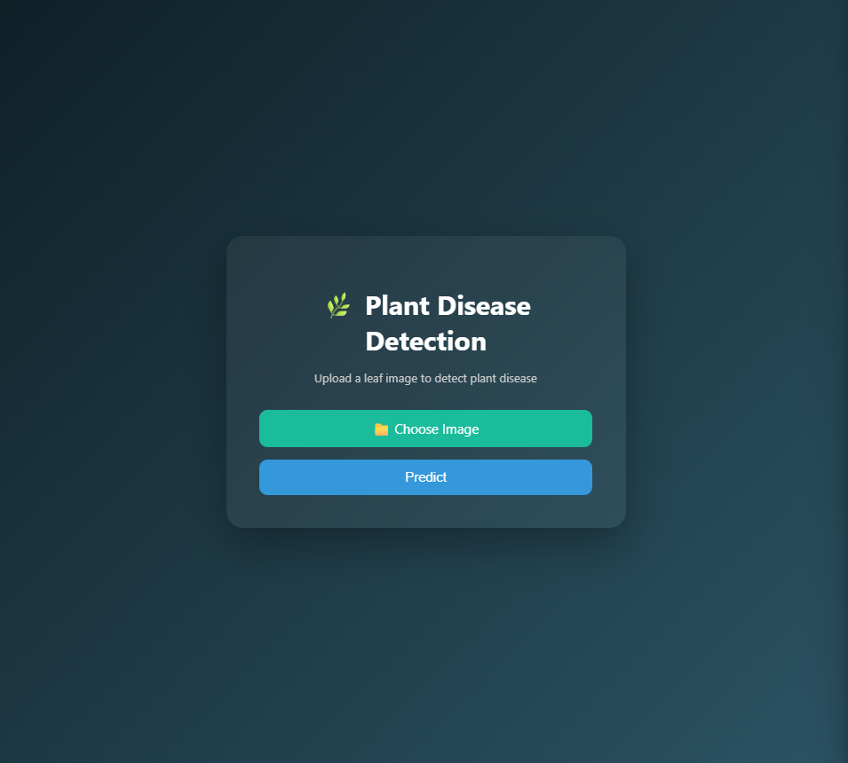
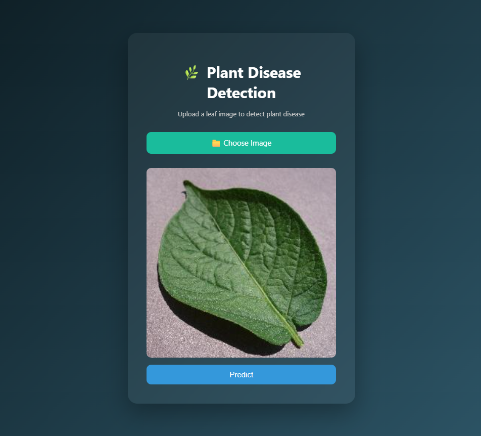
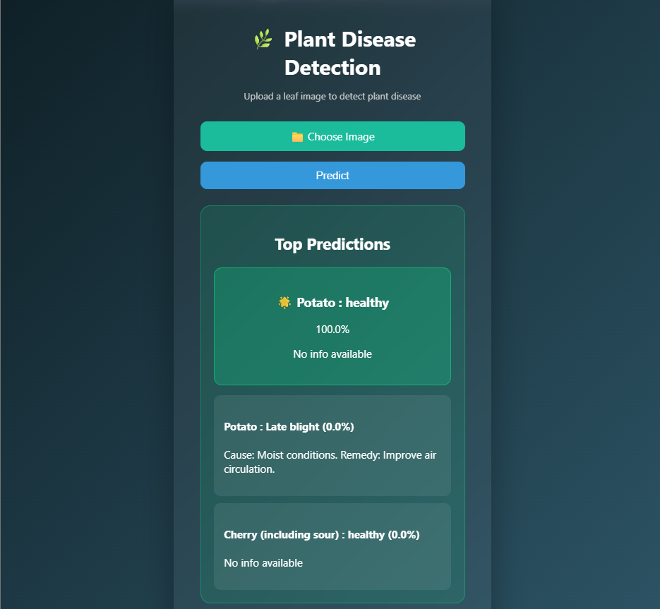

# 🌿 AI Powered Crop Disease Detection System

An end-to-end Deep Learning based web application that detects plant diseases from leaf images using Convolutional Neural Networks (CNN).

---

## 🌐 Live Demo

https://crop-disease-detection-ml-v2.onrender.com

---

## 🚀 Features

- ✅ Real-time plant disease prediction
- ✅ Top-3 prediction results
- ✅ Disease confidence scores
- ✅ Disease causes and remedies
- ✅ Modern responsive UI
- ✅ Image preview before prediction
- ✅ TensorFlow deep learning model
- ✅ Flask web application
- ✅ Cloud deployment using Render

---

## 🧠 Model Performance

| Metric | Value |
|--------|--------|
| Training Accuracy | 98% |
| Validation Accuracy | 95% |
| Classes | 38 |
| Framework | TensorFlow |

---

## 🛠 Tech Stack

- Python
- TensorFlow / Keras
- Flask
- HTML
- CSS
- JavaScript
- NumPy
- Pillow
- Render
- GitHub

---

## 📂 Project Structure

```text
crop_disease_prediction_v2/
│
├── app.py
├── requirements.txt
├── class_names.json
├── disease_info.json
├── saved_model/
├── templates/
│   └── index.html
├── static/
│   ├── style.css
│   └── script.js
└── README.md
```

---

## ⚙️ Installation

```bash
git clone https://github.com/varunb1410/crop-disease-detection-ml-v2.git

cd crop-disease-detection-ml-v2

pip install -r requirements.txt

python app.py
```

---

## 📸 Screenshots

- Homepage UI


- Image Upload


- Prediction Results


- Disease Remedies

---

## 🌱 Future Improvements

- Mobile App Version
- Disease Severity Detection
- Farmer Chatbot Assistant
- Multi-language Support
- Camera Capture Feature

---

## 👨‍💻 Developer

Varun Bhuvanagiri

GitHub:
https://github.com/varunb1410

LinkedIn:
https://in.linkedin.com/in/varun-bhuvanagiri-0a359624b